# Personal Finance System — Database & Telegram Bot Specification

## 1. Database Overview

### Core Concept

**Transaction is the single source of truth for all balances.** There are no stored balance columns anywhere. Every account's balance is:

```sql
SELECT SUM(amount) FROM Transaction WHERE accountId = X AND deleted_at IS NULL
```

Every financial event — a coffee purchase, a salary deposit, interest earned on savings, interest charged on a credit card, a loan payment — becomes a `Transaction` row.

### Sign Convention

The sign of `Transaction.amount` flips meaning depending on the account category:

| Account Category | Positive Amount | Negative Amount | Healthy Balance |
|---|---|---|---|
| Transactional / Savings / Investment | Money in (deposit, income, gains) | Money out (purchase, withdrawal) | Positive (you have money) |
| Credit / Loan (borrowed) | Debt increased (purchase, interest, fee) | Debt decreased (payment) | Trends toward zero (you owe less) |
| Loan (lent) | Amount owed to you increased | Amount owed to you decreased (they paid you) | Positive (they owe you) |

### Account Architecture

Every account starts as a row in `Account` with an `accountTypeId` pointing to `AccountType`. The `category` column on AccountType (`transactional | savings | investment | credit | loan`) determines which detail table to join — if any.

- **Transactional** (checking, debit, cash, prepaid): No detail table. Fully described by `Account` alone.
- **Savings**: Joins `SavingsAccountDetail` for rate, withdrawal limits, minimum balance.
- **Investment**: Joins `InvestmentAccountDetail` for maturity date, penalty, expected rate.
- **Credit**: Joins `CreditAccountDetail` for credit limit, interest rate, statement cycle.
- **Loan**: Joins `LoanAccountDetail` for principal, terms, rate, direction, and counterparty.

Detail tables hold product rules only — never balances.

### Inter-Account Transfers

Paying a credit card from checking, moving money to savings, etc. creates **two Transaction rows** linked via `linkedTransactionId`:

- One negative on the source account (money left)
- One positive on the destination account (money arrived)

### Person Entity

`Person` represents both individuals and institutions. The `type` field (`individual | institution`) distinguishes them. This single table is used for account ownership, shared expense participation, and loan counterparties.

### Category Types

`Category` classifies transactions and has a `type` field with three possible values:

| Type | Meaning | Examples |
|---|---|---|
| `income` | Money earned or received | Salary, Freelance, Interest, Refund |
| `expense` | Money spent | Food, Transport, Utilities, Entertainment |
| `system` | Internal bookkeeping events — not real income or spending | Initialization |

`system` categories are excluded from all budget queries by design — income queries filter on `type = 'income'` and spend queries filter on `type = 'expense'`. Any category that doesn't represent real user income or expense should be `system`.

### Statements

`AccountStatement` is a monthly snapshot — not a driver of balance. Primarily applies to credit and loan accounts. On the `statement_cut_day`, the app queries transactions for that billing cycle and inserts an AccountStatement row capturing: previous balance, new charges, payments received, interest charged, fees charged, and the resulting total balance. The `status` field tracks payment behavior (paid in full, paid minimum, overdue).

Statements are audit records you reconcile against your bank's PDF. They never override `SUM(Transaction.amount)` — if there's a discrepancy, the transactions need fixing.

### Installment Plans

When you make an MSI (months without interest) purchase, one `Transaction` for the full amount is created (increases debt on the card). An `InstallmentPlan` row links to that transaction and tracks the schedule: how many installments, how much per month, how many completed. No extra transactions are created for each installment — the plan is a visibility/tracking record.

### Account Status & History

Every account has a current status tracked via `accountStatusId` on `Account`, pointing to `AccountStatus`. Status changes are recorded in `AccountStatusHistory` with a reason and effective date. This provides a full audit trail of account lifecycle events.

| Status | Meaning |
|---|---|
| `active` | Normal operation, transactions allowed |
| `closed` | Paid off or cancelled, history preserved, no new transactions |
| `frozen` | Temporarily suspended, no new transactions, can be reactivated |

`deleted_at` (soft delete) is separate from status — it means "created by mistake, hide completely."

### Budget System

The budget system lets users set monthly income expectations and per-category spending ceilings, then track actuals against them.

**`BudgetPeriod`** stores one row per person per currency per month. It captures both `scheduled_income` (auto-computed from `ScheduledTransaction` at creation time, read-only snapshot) and `additional_income` (user-provided one-off income like bonuses or freelance). The derived `expected_income = scheduled_income + additional_income`.

**`BudgetCategory`** stores per-category spending ceilings within a budget period. Only `expense`-type categories can be budgeted.

Budget queries derive all actuals from `Transaction` — no stored balance columns. Transactions with `linkedTransactionId IS NOT NULL` (transfers) are excluded. The `ABS(amount)` approach normalizes spend across account types (expenses are negative on debit accounts, positive on credit accounts). This is safe because only categories with `type = 'expense'` are counted as spend.

### Audit Trail

Every entity mutation is logged in `AuditLog` with a `sourceId` pointing to `Source` (e.g., `telegram_bot`, `web_app`, `manual_import`). Every Telegram message is stored in `Message` with the raw content, parsed command, and media type.

### Key Query Patterns

| Question | Query |
|---|---|
| Current balance on any account | `SUM(amount) FROM Transaction WHERE accountId = X` |
| Available credit on a card | `credit_limit - SUM(amount)` joining CreditAccountDetail |
| Remaining loan principal (borrowed) | `original_principal + SUM(amount)` (payments are negative) |
| Amount someone owes you (lent) | `SUM(amount) FROM Transaction WHERE accountId = X` |
| Monthly installment obligation | `SUM(installment_amount) FROM InstallmentPlan WHERE status = 'active'` |
| Net worth | `SUM(amount)` grouped by account, flipping sign for credit and borrowed loans |
| What does Person X owe me total? | Union of: loan accounts where X is counterparty with direction='lent', plus SharedExpenseParticipant debts minus DebtPayments |
| Budget status for a month | See §5 — Budget Report Queries |

---

## 2. Telegram Bot — Account Creation Flows

### 2.1 General Rules (All Account Types)

1. **No assumptions.** The bot asks for every field explicitly. It does not infer, guess, or skip.
2. **Confirmation before write.** Every flow ends with a confirmation message showing ALL collected fields — including defaults and nulls — before any database write. The user must confirm with "Yes" to proceed.
3. **Initialization transaction.** Every account creation produces one `Transaction` with category = `"Initialization"` (type = `system`) and `transaction_date = today`. This sets the opening balance.
4. **Lookup fields.** Person, Currency, and AccountType are selected from existing database records. The bot presents available options (e.g., a numbered list of registered persons). If the referenced entity doesn't exist, the bot says so and offers to create it or re-prompt.
5. **Audit logging.** An `AuditLog` entry is created for each entity written, with `sourceId` pointing to the Telegram bot source and `source_entry_type = 'Message'` referencing the originating message.
6. **Status initialization.** Every new account is created with `accountStatusId` = `active` and an initial `AccountStatusHistory` row with reason `"Account created"`.
7. **Validation.** Numeric fields (amounts, rates, days) are validated on input. The bot rejects and re-prompts on invalid values (negative credit limits, cut day > 31, etc.).

### 2.2 `/account` — Transactional Account

Creates a checking, debit, cash, or prepaid account. No detail table.

**Step-by-step bot conversation:**

| Step | Bot asks | Field | Required | Default | Validation |
|---|---|---|---|---|---|
| 1 | "What's the name for this account?" | `Account.name` | yes | — | Max 150 chars |
| 2 | "Give it a short alias (or skip)" | `Account.alias` | no | `null` | Max 50 chars |
| 3 | "Who owns this account?" (show list from Person table) | `Account.personId` | yes | — | Must exist in Person |
| 4 | "What currency?" (show list from Currency table) | `Account.currencyId` | yes | — | Must exist in Currency |
| 5 | "What type of account?" (show list from AccountType where category = 'transactional') | `Account.accountTypeId` | yes | — | Must be transactional category |
| 6 | "What's the current balance?" | Initialization Transaction amount | yes | `0.00` | Decimal, >= 0 |

**Entities created:**
- 1x `Account`
- 1x `AccountStatusHistory` (status = active, reason = "Account created")
- 1x `Transaction` (amount = current balance, category = "Initialization")
- 3x `AuditLog` (one per entity)

---

### 2.3 `/savings` — Savings Account

Creates a savings account with optional product rules.

**Step-by-step bot conversation:**

| Step | Bot asks | Field | Required | Default | Validation |
|---|---|---|---|---|---|
| 1 | "What's the name for this account?" | `Account.name` | yes | — | Max 150 chars |
| 2 | "Give it a short alias (or skip)" | `Account.alias` | no | `null` | Max 50 chars |
| 3 | "Who owns this account?" | `Account.personId` | yes | — | Must exist in Person |
| 4 | "What currency?" | `Account.currencyId` | yes | — | Must exist in Currency |
| 5 | "What's the current balance?" | Initialization Transaction amount | yes | `0.00` | Decimal, >= 0 |
| 6 | "What's the minimum balance requirement? (or skip)" | `SavingsAccountDetail.minimum_balance` | no | `null` | Decimal, >= 0 |
| 7 | "Monthly withdrawal limit? (or skip)" | `SavingsAccountDetail.monthly_withdrawal_limit` | no | `null` | Integer, >= 0 |
| 8 | "Expected annual interest rate %? (or skip)" | `SavingsAccountDetail.expected_annual_rate` | no | `null` | Decimal, >= 0 |

AccountType is auto-set to the savings category — the bot does NOT ask the user to pick.

**Entities created:**
- 1x `Account` (accountTypeId forced to savings type)
- 1x `SavingsAccountDetail`
- 1x `AccountStatusHistory`
- 1x `Transaction` (initialization)
- 4x `AuditLog`

---

### 2.4 `/investment` — Investment Account

Creates an investment account (CETES, fixed-term deposit, brokerage, etc.).

**Step-by-step bot conversation:**

| Step | Bot asks | Field | Required | Default | Validation |
|---|---|---|---|---|---|
| 1 | "What's the name for this account?" | `Account.name` | yes | — | Max 150 chars |
| 2 | "Give it a short alias (or skip)" | `Account.alias` | no | `null` | Max 50 chars |
| 3 | "Who owns this account?" | `Account.personId` | yes | — | Must exist in Person |
| 4 | "What currency?" | `Account.currencyId` | yes | — | Must exist in Currency |
| 5 | "What's the current value?" | Initialization Transaction amount | yes | `0.00` | Decimal, >= 0 |
| 6 | "When does it mature? (or skip)" | `InvestmentAccountDetail.maturity_date` | no | `null` | Date, must be future |
| 7 | "Early withdrawal penalty %? (or skip)" | `InvestmentAccountDetail.early_withdrawal_penalty` | no | `null` | Decimal, >= 0 |
| 8 | "Expected annual rate %? (or skip)" | `InvestmentAccountDetail.expected_annual_rate` | no | `null` | Decimal, >= 0 |

AccountType auto-set to investment category.

**Entities created:**
- 1x `Account`
- 1x `InvestmentAccountDetail`
- 1x `AccountStatusHistory`
- 1x `Transaction` (initialization)
- 4x `AuditLog`

---

### 2.5 `/credit-card` — Credit Account

Creates a credit card account. This is the most complex flow because it optionally includes installment plan onboarding.

**Step-by-step bot conversation:**

| Step | Bot asks | Field | Required | Default | Validation |
|---|---|---|---|---|---|
| 1 | "What's the name for this card?" | `Account.name` | yes | — | Max 150 chars |
| 2 | "Give it a short alias (or skip)" | `Account.alias` | no | `null` | Max 50 chars |
| 3 | "Who owns this card?" | `Account.personId` | yes | — | Must exist in Person |
| 4 | "What currency?" | `Account.currencyId` | yes | — | Must exist in Currency |
| 5 | "What's the credit limit?" | `CreditAccountDetail.credit_limit` | yes | — | Decimal, > 0 |
| 6 | "Annual interest rate %?" | `CreditAccountDetail.annual_interest_rate` | yes | — | Decimal, >= 0 |
| 7 | "Statement cut day? (1–28)" | `CreditAccountDetail.statement_cut_day` | yes | — | Integer, 1–28 |
| 8 | "Payment due day? (1–28)" | `CreditAccountDetail.payment_due_day` | yes | — | Integer, 1–28 |
| 9 | "What's your current total debt?" | Initialization Transaction amount | yes | `0.00` | Decimal, >= 0 |
| 10 | "Do you have any active installment plans (MSI)?" | — | yes | no | yes/no |

**Note on step 7–8 validation:** Using 1–28 avoids ambiguity with months that don't have days 29–31. If the bank's actual cut day is 30 or 31, the user should use 28 and note the discrepancy.

**If step 10 = yes, loop for each installment plan:**

| Sub-step | Bot asks | Field | Required | Default | Validation |
|---|---|---|---|---|---|
| 10a | "What was purchased?" | `InstallmentPlan.description` | yes | — | Max 300 chars |
| 10b | "Total purchase amount?" | `InstallmentPlan.total_amount` | yes | — | Decimal, > 0 |
| 10c | "Total number of installments?" | `InstallmentPlan.total_installments` | yes | — | Integer, > 0 |
| 10d | "How many installments already paid?" | `InstallmentPlan.completed_installments` | yes | `0` | Integer, >= 0 and < total |
| 10e | "Interest rate on this plan %?" | `InstallmentPlan.interest_rate` | yes | `0` | Decimal, >= 0 |
| 10f | "When did this plan start?" | `InstallmentPlan.start_date` | yes | — | Date |
| 10g | "Add another installment plan?" | — | — | no | yes/no |

**Computed fields per plan:**
- `installment_amount` = `total_amount / total_installments` (for 0% interest). For plans with interest, use: `total_amount * (rate * (1+rate)^n) / ((1+rate)^n - 1)` where rate = monthly rate, n = total installments.
- `next_due_date` = start_date + (completed_installments + 1) months
- `status` = `active` (if completed < total), `completed` (if completed = total)

**Critical note in confirmation message:** "Your total debt of $X already includes the remaining installment balances. The installment plans are tracking records — no separate debt transactions are created for them."

**Entities created (Option A):**
- 1x `Account` (accountTypeId forced to credit type)
- 1x `CreditAccountDetail`
- 1x `AccountStatusHistory`
- 1x `Transaction` (amount = total debt, category = "Initialization")
- Nx `InstallmentPlan` (all pointing to the same initialization transaction via `transactionId`)
- (2 + N + 1)x `AuditLog`

**Onboarding trade-off (Option A):** All installment plans reference one generic initialization transaction. When querying "what was this plan's original purchase?", use `InstallmentPlan.description` instead of `Transaction.description`. For accounts created post-onboarding, each MSI purchase gets its own transaction with a 1:1 link to its InstallmentPlan.

---

### 2.6 `/loan` — Loan Account

Creates a loan account. Handles both borrowed (mortgage, car loan, bank loan) and lent (money you gave to someone).

**Step-by-step bot conversation:**

| Step | Bot asks | Field | Required | Default | Validation |
|---|---|---|---|---|---|
| 1 | "What's the name for this loan?" | `Account.name` | yes | — | Max 150 chars |
| 2 | "Give it a short alias (or skip)" | `Account.alias` | no | `null` | Max 50 chars |
| 3 | "Who owns this account?" | `Account.personId` | yes | — | Must exist in Person |
| 4 | "What currency?" | `Account.currencyId` | yes | — | Must exist in Currency |
| 5 | "Did you borrow this money or lend it?" | `LoanAccountDetail.direction` | yes | — | `borrowed` or `lent` |
| 6 | "Who did you [borrow from / lend to]?" (show list from Person table) | `LoanAccountDetail.counterpartyPersonId` | yes | — | Must exist in Person |
| 7 | "What was the original principal?" | `LoanAccountDetail.original_principal` | yes | — | Decimal, > 0 |
| 8 | "Annual interest rate %? (or 0 / skip for informal loans)" | `LoanAccountDetail.annual_interest_rate` | no | `0` | Decimal, >= 0 |
| 9 | "Term in months? (or skip for open-ended)" | `LoanAccountDetail.term_months` | no | `null` | Integer, > 0 |
| 10 | "When did this loan start?" | `LoanAccountDetail.start_date` | yes | — | Date |
| 11 | "When does it end? (or skip)" | `LoanAccountDetail.end_date` | no | Computed: start_date + term_months (if provided), else `null` | Date, must be after start_date |
| 12 | "Monthly payment amount? (or skip)" | `LoanAccountDetail.monthly_payment` | no | `null` | Decimal, > 0 |
| 13 | "What's the current outstanding balance?" | Initialization Transaction amount | yes | = original_principal | Decimal, > 0 |

**Step 5 drives step 6 phrasing:** If `borrowed`, bot says "Who did you borrow from?". If `lent`, bot says "Who did you lend to?".

**Initialization sign logic:**
- Both `borrowed` and `lent`: initialization amount is **positive**. For borrowed, positive = you owe this. For lent, positive = they owe you this. The `direction` field on LoanAccountDetail tells the net worth query how to interpret the balance.

**Net worth integration:**

```sql
SELECT SUM(
  CASE
    WHEN at.category IN ('transactional','savings','investment') THEN balance
    WHEN at.category = 'credit' THEN -balance
    WHEN at.category = 'loan' AND ld.direction = 'borrowed' THEN -balance
    WHEN at.category = 'loan' AND ld.direction = 'lent' THEN balance
  END
) AS net_worth
```

**Entities created:**
- 1x `Account` (accountTypeId forced to loan type)
- 1x `LoanAccountDetail`
- 1x `AccountStatusHistory`
- 1x `Transaction` (initialization)
- 4x `AuditLog`

---

## 3. Confirmation Message Templates (Account Creation)

### 3.1 Transactional Account

```
📋 New Transactional Account

Name:           BBVA Nómina
Alias:          bbva-main
Owner:          Esau
Currency:       MXN
Type:           Debit Card
Current Balance: $15,230.50

Status:         Active

⚠️ Fields set to null: (none)

Does this look correct? (Yes / No / Edit)
```

### 3.2 Savings Account

```
📋 New Savings Account

Name:           Hey Banco Savings
Alias:          hey-savings
Owner:          Esau
Currency:       MXN
Current Balance: $50,000.00

📊 Savings Details
Minimum Balance:         $1,000.00
Monthly Withdrawal Limit: 6
Expected Annual Rate:    13.00%

Status:         Active

⚠️ Fields set to null: (none)

Does this look correct? (Yes / No / Edit)
```

### 3.3 Investment Account

```
📋 New Investment Account

Name:           CETES 28-Day
Alias:          cetes-28
Owner:          Esau
Currency:       MXN
Current Value:  $100,000.00

📊 Investment Details
Maturity Date:              2025-08-15
Early Withdrawal Penalty:   null
Expected Annual Rate:       11.25%

Status:         Active

⚠️ Fields set to null:
  - Early withdrawal penalty

Does this look correct? (Yes / No / Edit)
```

### 3.4 Credit Account

```
📋 New Credit Card Account

Name:           BBVA Platinum
Alias:          bbva-plat
Owner:          Esau
Currency:       MXN
Current Debt:   $23,500.00

💳 Credit Details
Credit Limit:           $80,000.00
Annual Interest Rate:   36.50%
Statement Cut Day:      15
Payment Due Day:        5

📦 Installment Plans (2 active)
  1. MacBook Pro
     Total: $35,000.00 | 12 installments (4 paid, 8 remaining)
     Monthly: $2,916.67 | Rate: 0% | Started: 2025-01-15
     Next due: 2025-06-15

  2. Refrigerator
     Total: $18,000.00 | 6 installments (1 paid, 5 remaining)
     Monthly: $3,000.00 | Rate: 0% | Started: 2025-04-01
     Next due: 2025-06-01

⚠️ Your total debt of $23,500.00 already includes the remaining
   installment balances. The installment plans are tracking records
   only — no separate debt transactions will be created.

Status:         Active

Does this look correct? (Yes / No / Edit)
```

### 3.5 Loan Account (Borrowed)

```
📋 New Loan Account (Borrowed)

Name:           Car Loan
Alias:          car-loan
Owner:          Esau
Currency:       MXN
Direction:      Borrowed (you owe them)
Counterparty:   BBVA (institution)

💰 Loan Details
Original Principal:     $350,000.00
Annual Interest Rate:   12.50%
Term:                   48 months
Start Date:             2024-06-01
End Date:               2028-06-01
Monthly Payment:        $9,280.00
Outstanding Balance:    $310,000.00

Status:         Active

⚠️ Fields set to null: (none)

Does this look correct? (Yes / No / Edit)
```

### 3.6 Loan Account (Lent — Informal)

```
📋 New Loan Account (Lent)

Name:           Loan to Carlos
Alias:          carlos-loan
Owner:          Esau
Currency:       MXN
Direction:      Lent (they owe you)
Counterparty:   Carlos (individual)

💰 Loan Details
Original Principal:     $5,000.00
Annual Interest Rate:   0.00%
Term:                   null (open-ended)
Start Date:             2025-03-10
End Date:               null
Monthly Payment:        null
Outstanding Balance:    $5,000.00

Status:         Active

⚠️ Fields set to null:
  - Term
  - End date
  - Monthly payment

Does this look correct? (Yes / No / Edit)
```

---

## 4. Telegram Bot — Budget Flows

### 4.1 Scheduled Income Resolution Logic

Computing `scheduled_income` for a budget period requires resolving how many times each `ScheduledTransaction` with `category.type = 'income'` fires within the target month.

#### Occurrence count per frequency:

| Frequency | Logic | Example for April 2026 |
|---|---|---|
| `monthly` | 1 occurrence if `start_date <= last_day_of_month AND (end_date IS NULL OR end_date >= first_day_of_month)` | Salary: 1x |
| `biweekly` | Count how many `next_execution_date + (14 * n)` land within the month. Typically 2, occasionally 3 | Paycheck every 2 weeks: 2x or 3x |
| `weekly` | Count how many `next_execution_date + (7 * n)` land within the month. Typically 4, occasionally 5 | Weekly freelance: 4x or 5x |

#### Computation query (pseudo-SQL for monthly — simplest case):

```sql
SELECT SUM(st.amount)
FROM ScheduledTransaction st
JOIN Category c ON c.id = st.categoryId
WHERE c.type = 'income'
  AND st.deleted_at IS NULL
  AND st.currencyId = :currencyId
  AND st.start_date <= :last_day_of_month
  AND (st.end_date IS NULL OR st.end_date >= :first_day_of_month)
  AND st.frequency = 'monthly';
```

For `weekly` and `biweekly`, the application layer must compute the exact number of occurrences within the date range and multiply `amount × occurrence_count`. This is business logic, not a raw SQL query.

**Important:** The bot shows this computed number to the user during budget creation and asks them to confirm or adjust it.

---

### 4.2 `/budget` — Create a Budget Period

Creates a budget for a specific month with income expectations and category spending ceilings.

**General rules apply:** No assumptions, confirmation before write, audit logging, validation on every input.

**Step-by-step bot conversation:**

| Step | Bot asks | Field | Required | Default | Validation |
|---|---|---|---|---|---|
| 1 | "Which month do you want to budget? (e.g., April 2026)" | `BudgetPeriod.year_month` | yes | — | Must parse to a valid month. Stored as first day of that month |
| 2 | "What currency?" (show list from Currency table) | `BudgetPeriod.currencyId` | yes | — | Must exist in Currency. Must not already have a budget for this person+month+currency |
| 3 | _Bot computes scheduled income (see §4.1) filtered by selected currency and displays:_ "Your scheduled income for April 2026 is **$25,000.00 MXN** based on: \n• Salary (monthly): $25,000.00 × 1\nDo you have any additional income for this month? (amount or 'skip')" | `BudgetPeriod.additional_income` | no | `0` | Decimal, >= 0 |
| 4 | "Any notes for this budget? (or skip)" | `BudgetPeriod.notes` | no | null | Max 500 chars |
| 5 | "Which expense categories do you want to set a budget for?" _(show numbered list of all categories where type = 'expense')_ | multi-select | yes | — | At least 1 category must be selected |
| 6 | _For each selected category:_ "Budget for **[category name]**?" | `BudgetCategory.budgeted_amount` | yes | — | Decimal, > 0 |
| 7 | _(Loop)_ Repeat step 6 for each selected category | | | | |
| 8 | Confirmation message (see §4.4) | — | — | — | User must respond Yes / No / Edit |

**Step 3 detail:** The bot must list each scheduled income source individually so the user can verify. If no scheduled income exists, the bot says: "You have no scheduled income set up. Enter your expected income for this month (or 0):" — and stores the full amount in `additional_income`.

**Step 5 detail:** The bot shows the list and accepts comma-separated numbers (e.g., "1, 3, 5") or "all". Categories already budgeted (if editing) should be marked.

**Entities created:**
- 1x `BudgetPeriod`
- Nx `BudgetCategory` (one per selected category)
- (1 + N)x `AuditLog`

---

### 4.3 `/budget-report` — Query Budget Status

Displays the budget analysis for a given month. Read-only — no entities created.

**Step-by-step bot conversation:**

| Step | Bot asks | Notes |
|---|---|---|
| 1 | "Which month? (or press enter for current month)" | Default to current month |
| 2 | "What currency?" (show list from Currency table) | Lookup `BudgetPeriod` for this person+month+currency. If not found: "No budget found for [month] in [currency]. Create one with /budget" |
| 3 | _(Bot runs queries, renders report)_ | No further user input needed |

---

### 4.4 Budget Confirmation & Report Templates

#### `/budget` Confirmation

```
📋 New Budget — April 2026

👤 Owner: Esau
💱 Currency: MXN

💰 Income
   Scheduled:   $25,000.00 MXN
     • Salary (monthly): $25,000.00
   Additional:  $5,000.00 MXN
   ─────────────────────────
   Total expected: $30,000.00 MXN

📊 Category Budgets
   Food & Dining:      $5,000.00
   Transportation:     $2,000.00
   Utilities:          $1,500.00
   ─────────────────────────
   Total allocated:    $8,500.00

💡 Unallocated: $21,500.00

📝 Notes: Expecting freelance payment mid-month

⚠️ Fields set to null: (none)

Does this look correct? (Yes / No / Edit)
```

#### `/budget-report` Output

```
📊 Budget Report — March 2026

👤 Esau
💱 Currency: MXN

💰 Income
   Expected:       $30,000.00 MXN
     Scheduled:    $25,000.00
     Additional:   $5,000.00
   Received:       $15,000.00 MXN (50%)

📋 Budgeted Categories
   Food & Dining     $3,200 / $5,000  ████████░░░░ 64%   $1,800 left
   Transportation    $1,100 / $2,000  ███████░░░░░ 55%   $900 left
   Utilities         $0     / $1,500  ░░░░░░░░░░░░  0%   $1,500 left
   ─────────────────────────────────────────────────────
   Subtotal:         $4,300 / $8,500

🌀 Unbudgeted Spending: $2,300
   Clothing:    $2,150
   Coffee:      $150

📈 Summary
   🟢 Free (projected): $19,200
      = $30,000 expected − $8,500 budgeted − $2,300 unbudgeted
   💡 Free (to date):    $8,400
      = $15,000 received − $4,300 budgeted spent − $2,300 unbudgeted

⚠️ Alerts:
   • Food & Dining is 64% spent with ~50% of the month elapsed
```

#### Alert logic:

| Condition | Alert |
|---|---|
| Category spend > budgeted_amount | 🔴 **[Category] is over budget** by $X |
| Category spend % > month elapsed % + 15pp | ⚠️ **[Category] is [X]% spent** with ~[Y]% of the month elapsed |
| total_spent > received_to_date | 🔴 **You've spent more than you've received this month** |
| free_projected < 0 | 🔴 **Your budget exceeds your expected income** by $X |

Month elapsed % = `(current_day_of_month / total_days_in_month) × 100`. Only applies when querying the current month.

---

## 5. Budget Report — Query Breakdown

### 5.1 Income Section

```sql
-- Expected income (from BudgetPeriod)
scheduled_income + additional_income AS expected_income

-- Received to date (actual income transactions in the period)
SELECT SUM(t.amount)
FROM Transaction t
JOIN Category c ON c.id = t.categoryId
WHERE c.type = 'income'
  AND t.transaction_date >= :first_day_of_month
  AND t.transaction_date <= :last_day_of_month
  AND t.deleted_at IS NULL
  AND t.linkedTransactionId IS NULL
  AND t.currencyId = :currencyId
  AND t.accountId IN (SELECT id FROM Account WHERE personId = :personId AND deleted_at IS NULL);
```

### 5.2 Budgeted Categories Section

```sql
-- Per budgeted category: actual spend vs ceiling
SELECT
    c.name AS category_name,
    bc.budgeted_amount,
    COALESCE(ABS(SUM(t.amount)), 0) AS spent,
    bc.budgeted_amount - COALESCE(ABS(SUM(t.amount)), 0) AS remaining
FROM BudgetCategory bc
JOIN Category c ON c.id = bc.categoryId
LEFT JOIN Transaction t ON t.categoryId = bc.categoryId
    AND t.transaction_date >= :first_day_of_month
    AND t.transaction_date <= :last_day_of_month
    AND t.deleted_at IS NULL
    AND t.linkedTransactionId IS NULL
    AND t.currencyId = :currencyId
    AND t.accountId IN (SELECT id FROM Account WHERE personId = :personId AND deleted_at IS NULL)
WHERE bc.budgetPeriodId = :budgetPeriodId
  AND bc.deleted_at IS NULL
GROUP BY c.name, bc.budgeted_amount;
```

**Note on sign convention:** `ABS(SUM(amount))` normalizes spend across account types — expenses are negative on debit accounts but positive on credit accounts. `ABS` handles both. This is safe because only categories with `type = 'expense'` are included (see §6.5).

### 5.3 Unbudgeted Spending Section

```sql
-- Transactions in expense categories NOT in BudgetCategory for this period
SELECT c.name, ABS(SUM(t.amount)) AS spent
FROM Transaction t
JOIN Category c ON c.id = t.categoryId
WHERE c.type = 'expense'
  AND t.transaction_date >= :first_day_of_month
  AND t.transaction_date <= :last_day_of_month
  AND t.deleted_at IS NULL
  AND t.linkedTransactionId IS NULL
  AND t.currencyId = :currencyId
  AND t.accountId IN (SELECT id FROM Account WHERE personId = :personId AND deleted_at IS NULL)
  AND t.categoryId NOT IN (
      SELECT bc.categoryId FROM BudgetCategory bc
      WHERE bc.budgetPeriodId = :budgetPeriodId AND bc.deleted_at IS NULL
  )
GROUP BY c.name
HAVING SUM(t.amount) != 0
ORDER BY ABS(SUM(t.amount)) DESC;
```

### 5.4 Summary Calculations

```
total_budgeted       = SUM(bc.budgeted_amount) for all BudgetCategory rows
total_spent_budgeted = SUM of actual spend across budgeted categories
total_unbudgeted     = SUM of actual spend in unbudgeted categories
total_spent          = total_spent_budgeted + total_unbudgeted
received_to_date     = actual income received (query above)
expected_income      = scheduled_income + additional_income

free_projected       = expected_income - total_budgeted - total_unbudgeted
free_to_date         = received_to_date - total_spent
```

**`free_projected` definition:** This is what you'll have left if you spend exactly your budgeted amounts and no more unbudgeted spending occurs. It uses `total_budgeted` (the ceilings), not `total_spent_budgeted` (actuals), because it's a projection.

**`free_to_date` definition:** This is what you actually have right now — income received minus everything spent.

---

## 6. Edge Cases & Design Decisions

### 6.1 Budget already exists for that month

If the user runs `/budget` for a month+currency combination that already has a `BudgetPeriod`:
- Bot says: "You already have a budget for April 2026 in MXN. Do you want to (1) Edit it, (2) Delete and recreate, or (3) Cancel?"
- Edit flow: show current values, allow changing `additional_income`, `notes`, and individual `BudgetCategory` amounts. Allow adding/removing categories.
- `scheduled_income` is NOT recalculated on edit — it's a snapshot from creation time. If the user wants to refresh it, they delete and recreate.

### 6.2 No transactions yet

If the month hasn't started or no transactions exist:
- All "spent" values are $0
- `free_to_date` = negative of any unbudgeted spending (or $0)
- Report still renders — it's a projection tool too

### 6.3 Multi-currency

Handled by design. `BudgetPeriod.currencyId` is a required field, and the unique constraint is `(personId, year_month, currencyId)`. A user can have separate MXN and USD budgets for the same month. All income and spend queries filter by the budget's currency.

### 6.4 Transfers excluded

Inter-account transfers (transactions with `linkedTransactionId IS NOT NULL`) are **excluded** from all budget calculations. They're not income or expense — they're money moving between your own accounts. All budget queries include:

```sql
AND t.linkedTransactionId IS NULL
```

### 6.5 Credit card transactions

When you buy something with a credit card, the transaction is positive (debt increased) on the credit account. On a debit account, the same purchase is negative.

**Resolution:** The budget query uses `ABS(t.amount)` filtered by `c.type = 'expense'`. This is safe because:

- On transactional accounts, expenses are negative → ABS makes them positive
- On credit accounts, expenses (purchases) are positive → ABS keeps them positive
- Payments to credit cards are transfers (excluded by `linkedTransactionId IS NULL` filter)
- System categories like "Initialization" are `type = 'system'` and never match `type = 'expense'`

The `Category.type = 'system'` value is what makes this safe — only categories explicitly marked `expense` are counted as spend.

### 6.6 System categories excluded

Categories with `type = 'system'` (e.g., "Initialization") are excluded from all budget queries by default — the income queries filter on `type = 'income'` and spend queries filter on `type = 'expense'`. No additional exclusion logic needed.

---

## 7. Entity Relationship Diagram

```mermaid
erDiagram
    Source {
        int id PK
        string name "varchar 100"
        string code "varchar 50"
        timestamp created_at
        timestamp updated_at
        timestamp deleted_at
    }
    AuditLog {
        int id PK
        string entity_type "varchar 50"
        int entity_id
        string action "created | updated | deleted"
        int sourceId FK
        string source_entry_type "varchar 50 | nullable"
        int source_entry_id "nullable"
        timestamp created_at
    }
    Category {
        int id PK
        string name "varchar 100"
        string type "income | expense | system"
        timestamp created_at
        timestamp updated_at
        timestamp deleted_at
    }
    Currency {
        int id PK
        string name "varchar 100"
        string code "varchar 10"
        timestamp created_at
        timestamp updated_at
        timestamp deleted_at
    }
    Person {
        int id PK
        string name "varchar 150"
        string alias "varchar 50"
        string type "individual | institution"
        timestamp created_at
        timestamp updated_at
        timestamp deleted_at
    }
    AccountType {
        int id PK
        string name "varchar 100"
        string category "transactional | savings | investment | credit | loan"
        timestamp created_at
        timestamp updated_at
        timestamp deleted_at
    }
    AccountStatus {
        int id PK
        string name "varchar 50"
        timestamp created_at
        timestamp updated_at
        timestamp deleted_at
    }
    Account {
        int id PK
        string name "varchar 150"
        string alias "varchar 50"
        int accountTypeId FK
        int personId FK
        int currencyId FK
        int accountStatusId FK
        timestamp created_at
        timestamp updated_at
        timestamp deleted_at
    }
    AccountStatusHistory {
        int id PK
        int accountId FK
        int accountStatusId FK
        string reason "varchar 300 | nullable"
        date effective_date
        timestamp created_at
    }
    SavingsAccountDetail {
        int id PK
        int accountId FK "UNIQUE"
        decimal minimum_balance "nullable"
        int monthly_withdrawal_limit "nullable"
        decimal expected_annual_rate "nullable"
        timestamp created_at
        timestamp updated_at
        timestamp deleted_at
    }
    InvestmentAccountDetail {
        int id PK
        int accountId FK "UNIQUE"
        date maturity_date "nullable"
        decimal early_withdrawal_penalty "nullable"
        decimal expected_annual_rate "nullable"
        timestamp created_at
        timestamp updated_at
        timestamp deleted_at
    }
    CreditAccountDetail {
        int id PK
        int accountId FK "UNIQUE"
        decimal credit_limit
        decimal annual_interest_rate
        int statement_cut_day
        int payment_due_day
        timestamp created_at
        timestamp updated_at
        timestamp deleted_at
    }
    LoanAccountDetail {
        int id PK
        int accountId FK "UNIQUE"
        int counterpartyPersonId FK
        string direction "borrowed | lent"
        decimal original_principal
        decimal annual_interest_rate "nullable, default 0"
        int term_months "nullable"
        date start_date
        date end_date "nullable"
        decimal monthly_payment "nullable"
        timestamp created_at
        timestamp updated_at
        timestamp deleted_at
    }
    AccountStatement {
        int id PK
        int accountId FK
        date statement_date
        date payment_due_date
        decimal total_balance
        decimal minimum_payment
        decimal previous_balance
        decimal payments_received
        decimal new_charges
        decimal interest_charged
        decimal fees_charged
        string status "pending | paid_minimum | paid_full | overdue"
        timestamp created_at
        timestamp updated_at
        timestamp deleted_at
    }
    InstallmentPlan {
        int id PK
        int transactionId FK
        int accountId FK
        string description "varchar 300"
        int total_installments
        int completed_installments
        decimal installment_amount
        decimal total_amount
        decimal interest_rate
        date start_date
        date next_due_date
        string status "active | completed | cancelled"
        timestamp created_at
        timestamp updated_at
        timestamp deleted_at
    }
    ScheduledTransaction {
        int id PK
        decimal amount
        int currencyId FK
        string frequency "weekly | biweekly | monthly"
        int categoryId FK
        int accountId FK
        string description "varchar 300"
        date start_date
        date end_date
        date next_execution_date
        timestamp created_at
        timestamp updated_at
        timestamp deleted_at
    }
    SharedExpense {
        int id PK
        date event_date
        string name "varchar 150"
        int categoryId FK
        int paidById FK
        timestamp created_at
        timestamp updated_at
        timestamp deleted_at
    }
    SharedExpenseParticipant {
        int id PK
        int sharedExpenseId FK
        int personId FK
        decimal total_debt_amount
        timestamp created_at
        timestamp updated_at
        timestamp deleted_at
    }
    Transaction {
        int id PK
        date transaction_date
        decimal amount
        int currencyId FK
        int accountId FK
        int categoryId FK
        string description "varchar 300"
        int sharedExpenseId FK "nullable"
        int scheduledTransactionId FK "nullable"
        int linkedTransactionId FK "nullable"
        text notes
        timestamp created_at
        timestamp updated_at
        timestamp deleted_at
    }
    DebtPayment {
        int id PK
        int sharedExpenseParticipantId FK
        int transactionId FK
        timestamp created_at
        timestamp updated_at
        timestamp deleted_at
    }
    Message {
        int id PK
        string platformMessageId "varchar 500"
        text rawMessage
        string command "varchar 100"
        string type "audio | text | text_with_media"
        timestamp created_at
        timestamp updated_at
        timestamp deleted_at
    }
    BudgetPeriod {
        int id PK
        int personId FK
        int currencyId FK
        date year_month "first day of month, UNIQUE with personId + currencyId"
        decimal scheduled_income "auto-computed at creation"
        decimal additional_income "user-provided"
        text notes "nullable"
        timestamp created_at
        timestamp updated_at
        timestamp deleted_at
    }
    BudgetCategory {
        int id PK
        int budgetPeriodId FK
        int categoryId FK
        decimal budgeted_amount
        timestamp created_at
        timestamp updated_at
        timestamp deleted_at
    }

    Source ||--o{ AuditLog : "tracks"
    Person ||--o{ Account : "owns"
    Person ||--o{ SharedExpense : "pays for"
    Person ||--o{ SharedExpenseParticipant : "participates in"
    Person ||--o{ LoanAccountDetail : "counterparty for"
    Person ||--o{ BudgetPeriod : "budgets for"
    AccountType ||--o{ Account : "classifies"
    AccountStatus ||--o{ Account : "current status"
    AccountStatus ||--o{ AccountStatusHistory : "references"
    Currency ||--o{ Account : "denominates"
    Currency ||--o{ Transaction : "denominates"
    Currency ||--o{ ScheduledTransaction : "denominates"
    Currency ||--o{ BudgetPeriod : "denominates"
    Account ||--o| SavingsAccountDetail : "details"
    Account ||--o| InvestmentAccountDetail : "details"
    Account ||--o| CreditAccountDetail : "details"
    Account ||--o| LoanAccountDetail : "details"
    Account ||--o{ AccountStatusHistory : "tracks status of"
    Account ||--o{ AccountStatement : "produces"
    Account ||--o{ Transaction : "holds"
    Account ||--o{ ScheduledTransaction : "targets"
    Account ||--o{ InstallmentPlan : "has"
    Category ||--o{ Transaction : "categorizes"
    Category ||--o{ ScheduledTransaction : "categorizes"
    Category ||--o{ SharedExpense : "categorizes"
    Category ||--o{ BudgetCategory : "capped by"
    SharedExpense ||--o{ SharedExpenseParticipant : "splits among"
    SharedExpense ||--o{ Transaction : "generates"
    ScheduledTransaction ||--o{ Transaction : "generates"
    Transaction ||--o{ DebtPayment : "records"
    Transaction ||--o| InstallmentPlan : "originates"
    SharedExpenseParticipant ||--o{ DebtPayment : "tracks"
    BudgetPeriod ||--o{ BudgetCategory : "allocates"
```

